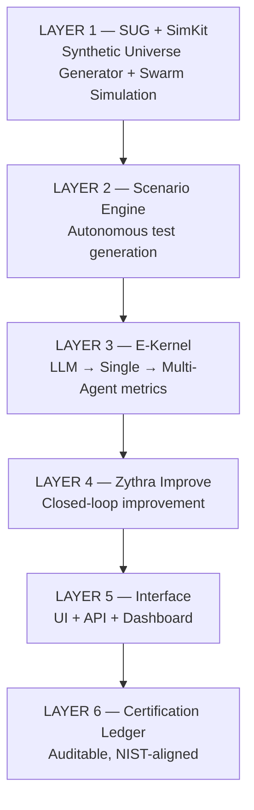

# Zythra Labs

**Trust Infrastructure for the Agentic Economy**

---

## What We're Building

AI agents can now write code, manage infrastructure, handle customer interactions, and coordinate complex workflows autonomously.

**The capability has arrived. The trust infrastructure has not.**

There is no standardized way to measure whether an AI agent is reliable enough to deploy without constant oversight. No ground-truth evaluation framework for agents operating in dynamic, adversarial environments. No formal certification standard enterprises can rely on.

**Zythra Labs is building that infrastructure.**

Not another evaluation dashboard —  
**the certification layer for autonomous systems.**

---

## The Problem — The Evaluation Gap

The gap between what agents can do and what we can *prove* about them.

| Dimension | Current State | What's Needed |
|-----------|--------------|---------------|
| **Static vs Dynamic** | Fixed benchmarks agents overfit to | Autonomous test generation that self-improves |
| **Isolated vs Situated** | Prompt-in, response-out testing | Population-based simulation with real user dynamics |
| **Probabilistic vs Ground-Truth** | LLM judges that hallucinate scores | Database-backed environments with verifiable state |
| **Single vs Multi-Agent** | Individual agent evaluation only | Multi-agent coordination and emergent failure detection |
| **Measurement vs Improvement** | Reports that sit on dashboards | Closed-loop systems that fix what they find |
| **Technical vs Accessible** | Requires deep engineering expertise | 60-second evaluation for any builder |
| **Scores vs Certification** | Performance numbers | Formally auditable, NIST-aligned certifications |

📄 Full analysis: **[The State of Agent Evaluation 2026](https://your-link)**

---

## Our Approach — Situated Evaluation

Agents cannot be evaluated in isolation.

Zythra evaluates agents inside realistic environments:
- adversarial users  
- dynamic state changes  
- unpredictable interactions  

We don’t just test agents.

**We let them fail in environments that resemble reality — then we fix them.**

---

## The Platform — Zythra Evaluation Stack

## The Standard We Hold Ourselves To

Every evaluation Zythra runs must produce insights that surprise even the agent's own builder — failure modes they did not anticipate, edge cases they did not consider, coordination breakdowns they did not design for.
If Zythra Evals saves time but reduces quality, it fails. If it produces results a developer could have generated manually, it fails.
The platform wins when a developer looks at their evaluation report and says: "I would never have found this myself."
That is the standard.

**The Vision — Beyond Evals**

Zythra Evals is Layer 1 of a four-product infrastructure stack.

The goal: the same foundational role for the agentic economy that TCP/IP plays for the internet. Protocol-level trust infrastructure — not a product built on the economy, but the infrastructure the economy is built on.

**Zythra Labs**

Building the Trust Layer for the Agentic Economy
Built in Africa. Built for the world.
